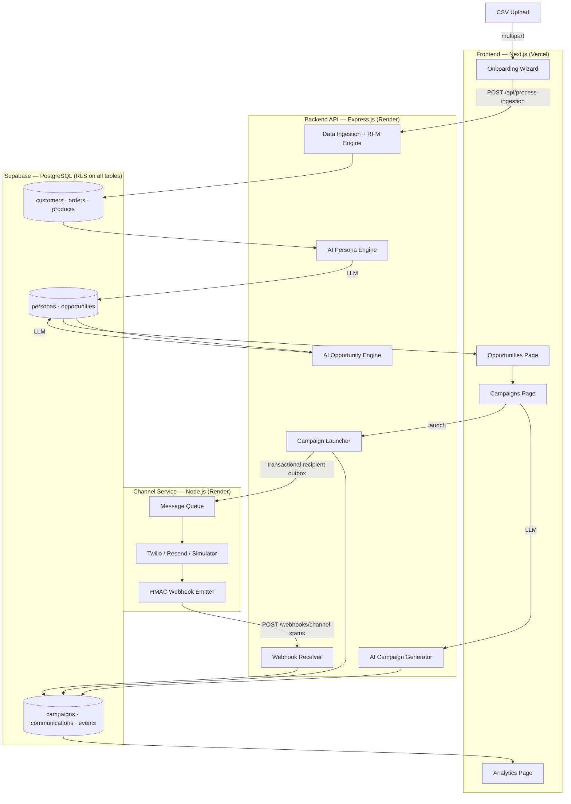

<h1 align="center">
  <br>
  
  <br>
  GrowthOS
  <br>
</h1>

<p align="center"><strong>A human-approved AI growth system that finds revenue gaps, drafts campaigns, delivers approved messages, and measures conversion.</strong></p>

<p align="center">
  <a href="https://growos-ai.vercel.app"></a>
  
  
  
  
  
</p>

<p align="center">
  <a href="#architecture">Architecture</a> •
  <a href="#what-i-built">What I Built</a> •
  <a href="#tradeoffs">Tradeoffs</a> •
  <a href="#ai-orchestration">AI Orchestration</a> •
  <a href="#getting-started">Getting Started</a>
</p>

**Live:** https://growos-ai.vercel.app — upload your own CSV and the agent runs in ~60 seconds.

---

## What It Does

Traditional CRMs make the marketer do all the thinking: build a segment, write a message, pick a channel, schedule a send. GrowthOS inverts this.

A scheduled growth agent prepares the work while the marketer keeps execution control:

1. Ingests your customer + order history (CSV upload)
2. Computes RFM behavioural segments, purchase patterns, and category preferences
3. Assigns AI-generated personas to each customer cluster
4. Surfaces revenue opportunities: *"76 dormant VIPs haven't bought in 90 days — ₹1.1L recoverable"*
5. Generates campaign copy, audience definition, recommended channel, and predicted revenue
6. Pauses durably for a marketer to review, refine, approve, and launch

**The marketer's job shifts from building to steering.**

---

## Architecture

Three independently deployable services:

```
┌─────────────────────────────────────────────────────────────┐
│  Frontend — Next.js App Router (Vercel)                     │
│  Onboarding · Dashboard · Opportunities · Campaigns · Analytics │
└────────────────────────┬────────────────────────────────────┘
                         │ REST + Auth JWT
┌────────────────────────▼────────────────────────────────────┐
│  Backend API — Express.js (Render)                          │
│  Ingestion · RFM Engine · AI Orchestrator · Campaign API     │
│  requireAuth + resolveCompanyMiddleware on every route       │
└──────────┬──────────────────────────────┬───────────────────┘
           │                              │ PostgreSQL + RLS
┌──────────▼──────────┐     ┌─────────────▼───────────────────┐
│ BullMQ Worker       │────▶│  Channel Service                 │
│ Recipient outbox    │     │  Twilio / Resend / Simulator    │
└──────────┬──────────┘     └─────────────┬───────────────────┘
           │ Redis                         │ HMAC callbacks
           └───────────────────────────────┘
```



---

## What I Built

### Auth + Multi-Tenancy
- **Supabase Auth** — email/password with JWT-based sessions
- **`requireAuth` middleware** on every Express route — rejects requests without a valid JWT
- **`resolveCompanyMiddleware`** resolves `companyId` exclusively from the authenticated user's DB profile — never trusted from the client request
- **Row-Level Security** enforced by PostgreSQL for tenant-owned tables, backed by real cross-tenant integration tests
- **Full multi-tenancy** — multiple companies can sign up; all data is completely isolated

### Data Ingestion Pipeline
- CSV upload (customers + orders) via bounded multipart requests, persisted as resumable ingestion sessions
- Idempotent Prisma upserts and batched PostgreSQL inserts for customers, products, orders, and line items
- RFM score computation: recency, frequency, monetary value per customer
- Customer attribute enrichment: average order value, category preferences, purchase intervals
- Persona assignment: LLM clusters customers into 4–6 behavioural archetypes per company
- Background processing — persona + agent setup is fire-and-forget; dashboard unlocks as soon as first opportunity is ready

### AI Orchestration
Persisted AI generation uses a **prompt → JSON parse → schema validate → DB write** contract. Analytics uses deterministic aggregation and a safe fallback when an optional narrative call fails.

| Step | Schema enforced | Fallback |
|---|---|---|
| Persona Engine | `{ persona_name, description, reasoning }` | Skip assignment, log |
| Opportunity Engine | Full typed opportunity object with numeric revenue fields | Discard, continue |
| Campaign Generator | `{ name, message_content, channel, objective, offer }` | Return error to frontend |

### Agent Orchestration
- An authenticated scheduler endpoint starts agent runs; overlapping ticks are rejected
- LangGraph persists campaign approval checkpoints in PostgreSQL and resumes after a human decision
- Involvement modes are typed and fail closed; no campaign sends without an approved state transition
- Agent runs and steps are persisted and surfaced in the activity feed

### Campaign Delivery
- Channel Service is a **separate process** — mirrors how real CRMs integrate with providers like Twilio/Resend
- Provider selection per channel: Twilio (WhatsApp/SMS), Resend (Email), Simulator fallback when no API keys set
- Transactional launch creates one durable recipient job per communication; BullMQ retries with backoff
- Frequency cap: max 2 messages/customer/day — suppressed with reason logged
- **Delivery state machine**: `QUEUED → SENT → DELIVERED → READ → CLICKED / FAILED`
- **HMAC-SHA256 webhook verification** — backend rejects any unsigned or tampered callback
- **Idempotency** — `processed_webhook_events` dedup table prevents duplicate processing
- **Out-of-order safety** — `sequenceNumber` ensures status only advances forward

### Frontend Performance
- **SWR cache** — module-level in-memory cache with per-endpoint TTLs; repeat page visits return data in <16ms while a background refresh runs silently
- Parallel data fetching — opportunities + campaigns fetched with `Promise.all`, not sequentially
- Cold-start mitigation — health checks warm the API; durable jobs survive slow provider startup

### CI / CD
- **GitHub Actions CI** — backend lint/typecheck/unit/real-PostgreSQL tests/builds, frontend lint/typecheck/build, and channel-service typecheck/build
- **Security gates** — full-history Gitleaks scan, critical runtime dependency audit, and rejection of committed build artifacts
- **Vercel** — Git integration on `main` (root directory: `frontend`) plus the Actions backup
- **Render** — `render.yaml` links both services to `Mithurn/GROWTH-OS` `main`, deploys only after CI checks pass, and runs `prisma migrate deploy` before the backend starts

---

## Tradeoffs

| Concern | What I did | What I'd do at scale |
|---|---|---|
| **Message delivery** | Simulator fallback when no provider keys set; Twilio/Resend wired and ready | Add provider keys; no code changes needed |
| **Job queue** | BullMQ backed by required Redis; a separate worker entrypoint is ready, while the free-tier manifest runs workers in the API process | Enable the dedicated worker service before production traffic |
| **Analytics realtime** | 5s polling on campaign analytics page | Supabase Realtime subscriptions |
| **Webhook ingestion** | Transactional Prisma write with deduplication | Stream events when measured volume requires it |
| **Cold starts** | Health ping pre-warms the Render API | Paid always-on API and worker instances |
| **Delivery guarantee** | Durable at-least-once jobs; Resend receives a provider idempotency key | Add a provider-side dedup key for Twilio if its API supports one |

---

## Data Model

```
companies
  └── profiles          (user → company mapping, enforces multi-tenancy)
  └── customers         (external_id, RFM scores, persona assignment)
      └── orders → order_items → products
  └── personas          (AI-generated behavioural archetypes)
  └── opportunities     (AI-detected, linked to persona distribution)
      └── opportunity_customers   (audience join table)
      └── campaigns     (AI-generated copy, channel, status)
          └── communications      (one row per recipient, status tracked)
              └── communication_events   (full delivery timeline)
              └── processed_webhook_events  (idempotency dedup)
  └── agents            (goal, guardrails, involvement level)
      └── agent_actions (activity log — powers the live feed)
  └── ingestion_sessions (upload progress tracking)
```

---

## Repository Structure

```
xeno-grow/
├── frontend/                    # Next.js App Router · Tailwind · TypeScript
│   ├── app/
│   │   ├── page.tsx             # Dashboard — opportunities + live agent activity
│   │   ├── onboarding/          # CSV upload + ingestion progress wizard
│   │   ├── opportunities/       # AI opportunity browser + goal input
│   │   ├── campaigns/           # Campaign builder + channel refiner
│   │   ├── analytics/           # Live campaign funnel + delivery stats
│   │   ├── personas/            # Customer persona breakdown
│   │   └── intelligence/        # AI intelligence brief
│   ├── lib/
│   │   ├── api.ts               # All API calls + SWR cache layer
│   │   └── supabase/            # Auth client + token helpers
│   └── components/
│
├── backend/                     # Express.js · Prisma · PostgreSQL · BullMQ · LangGraph
│   ├── src/
│   │   ├── server.ts            # API process
│   │   ├── worker.ts            # BullMQ worker process
│   │   ├── routes/              # Authenticated HTTP boundaries
│   │   ├── middleware/auth.ts   # JWT verification + company resolution
│   │   ├── services/
│   │   │   ├── customer-attributes.ts   # RFM + attribute engine
│   │   │   ├── personas.ts              # AI persona generation
│   │   │   ├── opportunity-discovery.ts # AI opportunity engine
│   │   │   ├── campaigns.ts             # Campaign CRUD + launch + state machine
│   │   │   ├── agent-logger.ts          # Activity feed writes
│   │   │   └── agent-orchestrator.ts    # Scheduled, overlap-safe agent runs
│   │   └── __tests__/           # Unit and real PostgreSQL integration suites
│   └── prisma/schema.prisma
│
├── channel-service/             # Standalone delivery service · Node.js
│   └── src/
│       ├── server.ts            # POST /send endpoint
│       ├── queue.ts             # Async message processor
│       ├── webhook.ts           # HMAC-signed callback emitter
│       └── providers/
│           ├── twilio.ts        # WhatsApp + SMS
│           ├── resend.ts        # Email
│           └── simulator.ts     # Fallback — QUEUED→SENT→DELIVERED→READ progression
│
├── .github/workflows/ci.yml     # Typecheck + test pipeline (3 parallel jobs)
├── render.yaml                  # Declarative Render deployment config
└── scripts/start-all.sh         # Local dev: starts all 3 services
```

---

## Getting Started Locally

**Prerequisites:** Node.js 22+, PostgreSQL with pgvector, Redis, Supabase Auth, and an OpenRouter API key

```bash
git clone https://github.com/Mithurn/xeno-grow
cd xeno-grow
chmod +x scripts/start-all.sh && ./scripts/start-all.sh
```

| Service | URL |
|---|---|
| Frontend | http://localhost:3000 |
| Backend API | http://localhost:3001 |
| Channel Service | http://localhost:5001 |

### Environment Variables

**`backend/.env`**
```env
NEXT_PUBLIC_SUPABASE_URL=
SUPABASE_ANON_KEY=
DATABASE_URL=
OPENROUTER_API_KEY=
OPENROUTER_BASE_URL=https://openrouter.ai/api/v1
OPENROUTER_MODEL=openrouter/free
CHANNEL_SERVICE_URL=http://localhost:5001
WEBHOOK_SECRET=                  # openssl rand -base64 32
FRONTEND_URL=http://localhost:3000
```

**`channel-service/.env`**
```env
CRM_WEBHOOK_URL=http://localhost:3001/api/webhooks/channel-status
WEBHOOK_SECRET=                  # must match backend exactly
FAILURE_RATE=10                  # % of simulated sends that fail
# Optional — real sends when set:
# RESEND_API_KEY=
# TWILIO_ACCOUNT_SID=
# TWILIO_AUTH_TOKEN=
# TWILIO_PHONE_NUMBER=
# TWILIO_WHATSAPP_NUMBER=
```

**`frontend/.env.local`**
```env
NEXT_PUBLIC_SUPABASE_URL=
NEXT_PUBLIC_SUPABASE_ANON_KEY=
NEXT_PUBLIC_API_URL=http://localhost:3001/api
```

### Generate Demo Data

```bash
cd backend
TOTAL_CUSTOMERS=500 TOTAL_ORDERS=3000 npm run generate:data
# Outputs: backend/generated-data/customers.csv + orders.csv
# Upload both via the onboarding wizard at http://localhost:3000/onboarding
```

The agent will process your data and surface opportunities in ~60 seconds.
