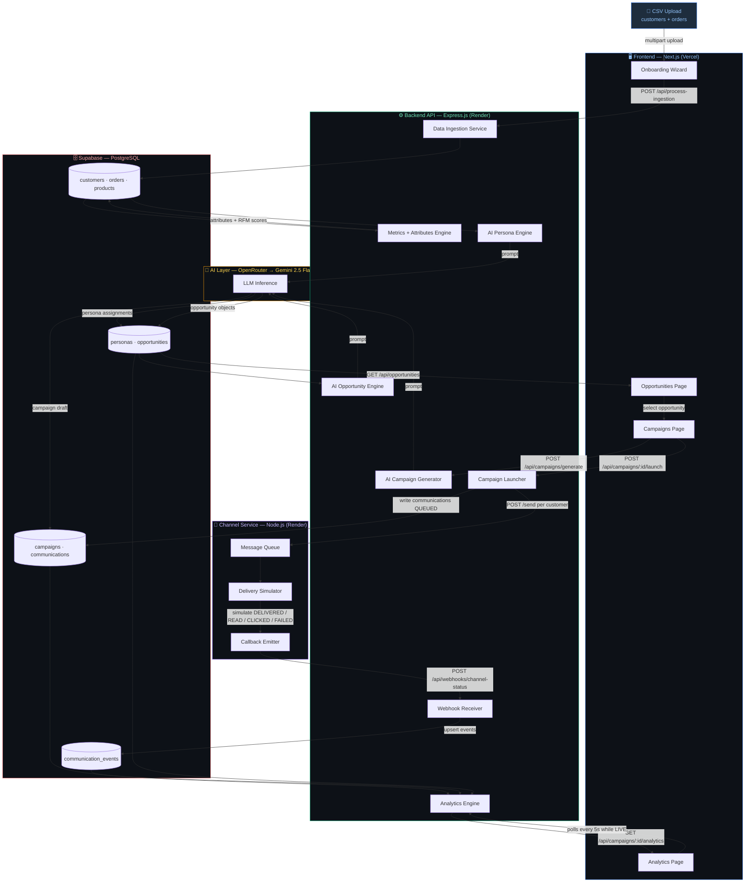

# Xeno Growth OS

> **An autonomous AI Growth Copilot — not a dashboard you fill in, but an agent that finds your revenue gaps, writes the campaign, executes it across 500 customers, and shows you live what converted.**

**Live Demo:** https://xeno-grow.vercel.app
**Repo:** https://github.com/Mithurn/xeno-grow
**Stack:** Next.js 16 · Express.js · Node.js · Supabase (PostgreSQL) · OpenRouter → Gemini 2.5 Flash

---

## 1. Product Scoping: What I Built & Why

The brief was intentionally open. My bet was this: **the hardest part of CRM isn't sending campaigns — it's knowing what to send, to whom, and why.**

Traditional CRMs make the marketer do all the thinking: build an audience rule, write a message, pick a channel. That's a blank canvas. Xeno Growth OS inverts this.

Instead of a segment builder, there's an **Autonomous Opportunity Engine** that runs every 5 minutes:

1. Analyses unified customer behaviour — RFM scores, purchase patterns, category preferences, persona signals
2. Proactively surfaces revenue opportunities — *"77 Dormant VIPs haven't bought in 60 days — ₹3.9L recoverable"*
3. Auto-generates the audience definition, recommended channel, personalised message copy, and predicted revenue
4. The marketer reviews, refines in natural language, approves, and launches — the AI handles the rest

**The marketer's role shifts from building to steering.**

### What I explicitly chose NOT to build

| Cut | Reason |
|-----|--------|
| Auth / login flows | Company ID via localStorage is sufficient for a demo scope; JWT + Supabase Row Level Security is the production path |
| Real messaging providers (Twilio, Gupshup) | The stubbed channel service is architecturally equivalent and demonstrates the async delivery lifecycle more cleanly |
| Rule-builder segment UI | The AI-native approach makes manual segment building unnecessary — the Opportunity Engine does this automatically |
| A/B testing, scheduling, frequency capping | Valid next features; out of scope for the time constraint |
| Multi-tenancy | Single-tenant, single company for this scope |

Cutting these freed 100% of the engineering time for the AI orchestration layer and the async webhook architecture — the parts that actually demonstrate the thinking.

---

## 2. System Architecture



Three decoupled services, each independently deployable and replaceable:

- **Frontend (Vercel)** — Next.js 16 App Router. Stateless; all data from the backend API.
- **Backend API (Render)** — Express.js. Owns all business logic, AI orchestration, data ingestion, and webhook reception.
- **Channel Service (Render)** — Standalone Node.js process. Owns delivery simulation and fires HMAC-signed webhooks back to the backend asynchronously.

The channel service is a **separate process by design** — it mirrors how real-world CRMs integrate with providers like Twilio or Gupshup. Swapping the stub for a real provider requires zero changes to the CRM backend.

---

## 3. Scale Assumptions & Tradeoffs

> *"I'd do X at scale but did Y for this scope"*

| Concern | What I did | What I'd do at scale |
|---------|-----------|---------------------|
| **Analytics delivery** | 5s polling on the analytics page | WebSockets or Supabase Realtime subscriptions |
| **Webhook ingestion** | Inline Supabase upsert per webhook event | Push to SQS / Kafka; worker pool consumes and batches writes |
| **AI calls** | Sequential, per-request (persona → opportunity → campaign) | Background job queue (Bull/BullMQ) with retries, backoff, and dead-letter |
| **Auth** | Company ID stored in localStorage | JWTs + Supabase Row Level Security on every table |
| **Campaign launch** | `Promise.allSettled` — all sends in parallel | Chunked batching with per-chunk rate limiting and backpressure |
| **Webhook reliability** | 3 retries with 15s / 30s / 60s backoff | Exponential backoff with jitter; dead-letter queue for failed events |
| **Cold starts** | Health-ping on page load to pre-warm Render free tier | Paid tier with always-on instances; or serverless with provisioned concurrency |

The webhook loop has three production-grade properties even at this scope:
- **Idempotency** — each event carries a unique `event_id`; the receiver deduplicates before writing via `processed_webhook_events` table
- **Out-of-order safety** — events carry a `sequenceNumber`; status only advances forward, never backwards
- **HMAC signature verification** — every webhook is signed with a shared secret; the backend rejects any unsigned or tampered request with 401

---

## 4. Code Quality: Deterministic AI Orchestration

A major challenge with LLMs in production is unpredictable text outputs breaking application state. Every AI step in this codebase uses a strict **structured prompt → JSON parse → validate → store** pattern. The LLM never outputs free-form text that touches the UI directly.

```
Prompt (strict schema contract)
    ↓
LLM response (raw string)
    ↓
JSON.parse() → schema validation
    ↓
Safe write to PostgreSQL
    ↓
Typed API response to frontend
```

| Pipeline Step | Prompt enforces | Fallback if malformed |
|---|---|---|
| Persona Engine | `{ persona_name, description, reasoning }` per customer | Skip assignment, log error |
| Opportunity Engine | Full opportunity object with typed numeric fields | Discard opportunity, continue |
| Campaign Generator | `{ name, message_content, channel, objective, expected_outcome }` | Return error to frontend |
| Analytics Insights | `{ learnings: string[], nextAction: { title, potentialRevenue, confidence } }` | Return empty insights, never crash |

Key files: `backend/src/services/opportunities.ts`, `backend/src/services/campaigns.ts`, `backend/src/services/personas.ts`

---

## 5. AI-Native Development Workflow

This project was built treating the developer as **Principal Architect** and AI agents as **Implementers**:

| Phase | Who | What |
|-------|-----|------|
| System design | Human | Defined the 3-service architecture, async webhook loop, database schema, and AI pipeline upfront — before writing a line of code |
| Architectural validation | Human + AI | Used Claude as a sounding board to pressure-test decisions (e.g. polling vs. WebSockets, inline upserts vs. a queue) and explicitly surface the tradeoffs |
| Implementation | AI Agents | Claude Code and Google Stitch used as autonomous coding agents to scaffold the Next.js frontend, wire up Express routes, generate the Tailwind/shadcn UI, and implement the channel service |
| Review & hardening | Human | All AI output rigorously reviewed — especially webhook idempotency logic, HMAC verification, sequence number enforcement, and structured prompt contracts |

The result: a fully functional, production-aware system built at a speed that would be impossible without AI tooling — while maintaining full understanding of every architectural decision.

---

## 6. Data Model

```
companies
    └── customers (external_customer_id, RFM metrics, persona)
        └── orders → order_items → products

    └── personas (AI-assigned segment per customer)
    └── opportunities (AI-detected, linked to persona distribution)
        └── opportunity_customers (audience join table)
        └── campaigns (AI-generated, linked to opportunity)
            └── communications (one per recipient, status tracked)
                └── communication_events (QUEUED → SENT → DELIVERED → READ → CLICKED / FAILED)
                └── processed_webhook_events (idempotency dedup table)
```

---

## 7. Repository Structure

```
xeno-grow/
├── frontend/          # Next.js 16 App Router · Tailwind CSS · Recharts
│   ├── app/
│   │   ├── page.tsx              # Home / Overview dashboard
│   │   ├── onboarding/           # Data ingestion wizard
│   │   ├── opportunities/        # AI opportunity discovery
│   │   ├── campaigns/            # Campaign management
│   │   └── analytics/            # Live campaign analytics
│   └── components/
│       └── nav-header.tsx
│
├── backend/           # Express.js REST API · Supabase · OpenRouter
│   └── src/
│       ├── server.ts             # All API routes
│       └── services/
│           ├── personas.ts       # AI persona generation
│           ├── opportunities.ts  # AI opportunity detection
│           ├── campaigns.ts      # Campaign CRUD + launch
│           ├── analytics.ts      # Funnel + insights engine
│           ├── webhooks.ts       # Channel webhook receiver
│           └── data-generator/   # Synthetic CSV generator
│
├── channel-service/   # Standalone Node.js delivery simulator
│   └── src/
│       ├── server.ts             # /send endpoint
│       ├── queue.ts              # Async message processor
│       └── webhook.ts            # HMAC-signed callback emitter
│
└── render.yaml        # Render deployment config (backend + channel-service)
```

---

## 8. Getting Started Locally

### Prerequisites
- Node.js v18+
- Supabase project (PostgreSQL)
- OpenRouter API key

```bash
git clone https://github.com/Mithurn/xeno-grow
cd xeno-grow && chmod +x scripts/start-all.sh && ./scripts/start-all.sh
```

| Service | URL |
|---|---|
| Frontend | http://localhost:3000 |
| Backend API | http://localhost:3001 |
| Channel Service | http://localhost:5001 |

### Environment Variables

**backend/.env**
```
NEXT_PUBLIC_SUPABASE_URL=
SUPABASE_SERVICE_ROLE_KEY=
OPENROUTER_API_KEY=
CHANNEL_SERVICE_URL=http://localhost:5001
WEBHOOK_SECRET=
```

**channel-service/.env**
```
CRM_WEBHOOK_URL=http://localhost:3001/api/webhooks/channel-status
WEBHOOK_SECRET=
FAILURE_RATE=10
```

### Generate Demo Data

```bash
cd backend
TOTAL_CUSTOMERS=500 TOTAL_ORDERS=3000 npm run generate:data
# Outputs: backend/generated-data/customers.csv + orders.csv
# Upload both via the onboarding flow at /onboarding
```
