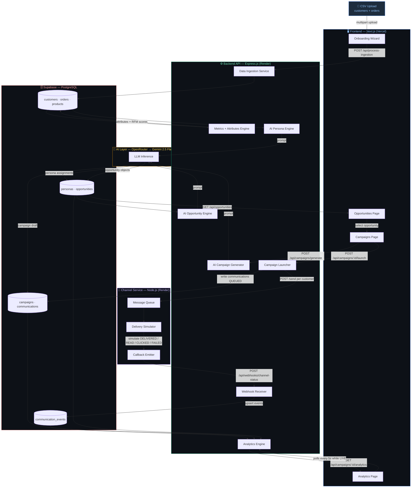

# Xeno Growth OS — AI-Native Mini CRM

> Built for the Xeno Engineering Take-Home Assignment · June 2026

Xeno Growth OS helps consumer brands discover hidden revenue in their customer data and execute personalised campaigns across WhatsApp, SMS, and Email — with AI doing the heavy lifting at every step.

**Live Demo:** https://xeno-grow.vercel.app  
**Stack:** Next.js · Express.js · Node.js · Supabase (PostgreSQL) · OpenRouter → Gemini 2.5 Flash

---

## The AI-Native Approach

Traditional CRMs require the marketer to *know what to look for* — build an audience, write a message, pick a channel. This product inverts that model.

Instead of a blank canvas, Xeno Growth OS has an **Autonomous Opportunity Engine**:

1. The AI continuously analyses unified customer behaviour (RFM scores, purchase patterns, persona signals)
2. It proactively surfaces revenue opportunities — *"450 Dormant VIPs haven't bought in 60 days, potential recovery: ₹1.4L"*
3. It auto-generates the audience definition, recommended channel, campaign copy, and predicted revenue
4. The marketer reviews, refines via chat, and launches — the AI handles the rest

**The marketer's role shifts from building to steering.**

---

## Architecture



---

## Key Design Decisions

### 1. Three-Service Architecture
The backend and channel service are deliberately separate processes. This mirrors how real-world CRMs integrate with providers like Twilio or Gupshup — the CRM owns business logic, the provider owns delivery. Keeping them separate means the channel simulation can be swapped for a real provider with zero changes to the CRM.

### 2. Asynchronous Webhook Loop
When a campaign launches, the flow is:

```
Backend → POST /send (per recipient) → Channel Service
                                              ↓ (async, simulates latency + stochastic outcomes)
Backend ← POST /api/webhooks/channel-status ← Channel Service
    ↓
communication_events table
    ↓
Analytics page (polls every 5s, all charts update live)
```

Key engineering properties of this loop:
- **Idempotency** — each webhook carries a unique `event_id`; the receiver deduplicates before writing
- **Out-of-order safety** — events carry a `sequenceNumber`; status only advances if the incoming sequence ≥ current
- **HMAC signature verification** — the channel service signs every webhook payload; the backend rejects unsigned requests

### 3. AI Pipeline (Data → Insight → Action)
Every AI step uses a structured JSON prompt → parse → store pattern, never free-form text in the UI:

| Step | Input | AI Output | Stored As |
|---|---|---|---|
| Persona Engine | RFM scores + purchase history | Persona labels + reasoning | `personas` table |
| Opportunity Engine | Persona distribution + revenue data | Opportunity objects with audience size + predicted revenue | `opportunities` table |
| Campaign Generator | Opportunity context + channel | Campaign name, message copy, offer | `campaigns` table |
| Analytics Insights | Live funnel data | Learnings + next best action | Returned inline |

### 4. Scale Tradeoffs (Explicit)
| Decision | Choice Made | Production Alternative |
|---|---|---|
| Webhook processing | Inline Supabase upsert | Push to SQS/Kafka, worker pool |
| Analytics | 5s polling | WebSockets or Supabase Realtime |
| AI calls | Sequential, per-request | Background job queue with retries |
| Auth | Company ID via localStorage | JWT + Row Level Security on all tables |

---

## Data Model

```
companies
    └── customers (external_customer_id, RFM metrics, persona)
        └── orders → order_items → products

    └── personas (AI-assigned segment per customer)
    └── opportunities (AI-detected, linked to persona distribution)
        └── campaigns (AI-generated, linked to opportunity)
            └── communications (one per recipient, status tracked)
                └── communication_events (QUEUED → SENT → DELIVERED → READ → CLICKED)
```

---

## Getting Started

### Prerequisites
- Node.js v18+
- Supabase project (PostgreSQL)
- OpenRouter API key

### Run Locally

```bash
# Clone and install
git clone https://github.com/Mithurn/xeno-grow
cd xeno-grow && chmod +x start-all.sh && ./start-all.sh
```

| Service | URL |
|---|---|
| Frontend | http://localhost:3000 |
| Backend API | http://localhost:3001 |
| Channel Service | http://localhost:5001 |

### Environment Variables

**backend/.env**
```
NEXT_PUBLIC_SUPABASE_URL=
SUPABASE_SERVICE_ROLE_KEY=
OPENROUTER_API_KEY=
CHANNEL_SERVICE_URL=http://localhost:5001
WEBHOOK_SECRET=
```

**channel-service/.env**
```
CRM_WEBHOOK_URL=http://localhost:3001/api/webhooks/channel-status
WEBHOOK_SECRET=
```

### Generate Demo Data

```bash
cd backend
TOTAL_CUSTOMERS=500 TOTAL_ORDERS=3000 npm run generate:data
# Outputs: backend/generated-data/customers.csv + orders.csv
# Upload both via the onboarding flow
```

---

## Repository Structure

```
xeno-grow/
├── frontend/          # Next.js 16 App Router · Tailwind CSS · Recharts
│   ├── app/
│   │   ├── page.tsx              # Home / Overview dashboard
│   │   ├── onboarding/           # Data ingestion wizard
│   │   ├── opportunities/        # AI opportunity discovery
│   │   ├── campaigns/            # Campaign management
│   │   └── analytics/            # Live campaign analytics
│   └── components/
│       └── nav-header.tsx
│
├── backend/           # Express.js REST API · Supabase · OpenRouter
│   └── src/
│       ├── server.ts             # All API routes
│       └── services/
│           ├── personas.ts       # AI persona generation
│           ├── opportunities.ts  # AI opportunity detection
│           ├── campaigns.ts      # Campaign CRUD + launch
│           ├── analytics.ts      # Funnel + insights engine
│           ├── webhooks.ts       # Channel webhook receiver
│           └── data-generator/   # Synthetic CSV generator
│
├── channel-service/   # Standalone Node.js delivery simulator
│   └── src/
│       ├── server.ts             # /send endpoint
│       ├── queue.ts              # Async message queue
│       └── webhook.ts            # Callback emitter
│
└── render.yaml        # Render deployment config (backend + channel-service)
```

---

## What I Chose NOT to Build

- Real messaging provider integration (Twilio, Gupshup) — the stub is intentional and architecturally equivalent
- Auth / multi-tenancy — company ID via localStorage; RLS is the production path
- A/B testing, campaign scheduling, frequency capping — valid next features, out of scope for the time constraint
- A rule-builder segment UI — the AI-native approach makes this unnecessary for the core demo

---

*Built with Claude Code as the primary development environment — AI-native workflow throughout.*
